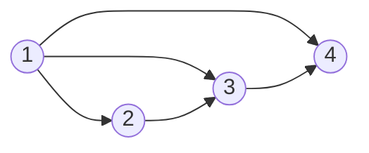

# 线性代数

## Linear Algebra Done Right

###  壹 向量空间

**向量空间的性质**

| 性质       | 说明                                     |
| ---------- | ---------------------------------------- |
| 交换性     | u + v = v + u                            |
| 结合性     | (u + v) + w = u + (v + w); (ab)v = a(bv) |
| 加法单位元 | 存在0, v + 0 = v，且加法单位元唯一       |
| 加法逆元   | 存在w, v + w = 0，且加法逆元唯一         |
| 乘法单位元 | 1v = v                                   |
| 分配性质   | (a + b)v = av + bv                       |

**V的子集U是V的子空间当且仅当满足以下条件**

| 性质           | 说明                                    |
| -------------- | --------------------------------------- |
| 加法单位元     | 0$\in$U                                 |
| 加法封闭性     | u,w$\in$U $\Rightarrow$ u + w $\in$U    |
| 标量乘法封闭性 | a$\in$F, u$\in$U $\Rightarrow$ au$\in$U |

<!--more-->

**推导性质：**

1. 明显地，子空间必定为向量空间并且子空间最小为{0},即至少需要包括加法单位元。
2. 子空间的和是包含这些子空间的最小子空间，因为易证子空间之和也为子空间，由定义可知子空间和是包含原所有子空间的最小子空间。
3. **直和**。若子空间之和$U_1 + ……+ U_m$中的每个元素都可以唯一地表示为$u_1 + ……+ u_m$，其中uj$\in$Uj，则$U_1 + ……+ U_m$称为直和。
4. $U_1 + ……+ U_m$为直和，当前仅当加法单位元0表示成$u_1 + ……+ u_m$的唯一方式是每个uj都等于0。
5. 若U,W都是V的子空间，U+W为直和当且仅当U$\cap$W = {0}。

### 贰 有限维向量空间

**张成空间**

V中一组向量$u_1,  …… , u_m$的所有线性组合所构成的集和称为$u_1,  …… , u_m$的张成空间，记为span($u_1,  …… , u_m$)。空向量组（）的张成空间定义为{0}。

**张成空间的性质**

1. 由张成空间的性质易证张成空间为子空间，又由于子空间的封闭性，V中一组向量的张成空间是包含着组向量的最小子空间。
2. 若一个向量空间可以有该空间内的某个向量组张成，则称这个向量空间为有限维向量空间。

**线性无关**

如果使得V中的一组向量$v_1……v_m$，当且仅当a1 = …… = am = 0时，有$a_1v_1 + …… + a_mv_m$ = 0，称其线性无关。

规定空组（）线性无关。

**线性相关性引理**

1. 设$v_1……v_m$是v中的一个线性相关的向量组，则有j$\in${1, 2,  ……, m}使得：
   1. vj$\in$span(v1, ……, v2);
   2. 若从$v_1……v_m$，中去掉vj，则剩余组的张成空间等于span($v_1, ……., v_m$);
2. 线性无关组的长度$\leq$线性相关组的长度
3. 有限维向量空间的子空间都是有限维的。

**基**

若V中的一个向量组既线性无关又张成V，则这个向量组称为V的基。

**基的判定准则**

$v_1, ……., v_m$是向量空间V中的基当且仅当对于v$\in$V都能唯一地写成以下形式：v =$ a_1v_1 + …… + a_mv_m$。

**基的相关性质**

1. 在向量空间中，每个张成组都可以简化为一个基。
2. 每个有限维向量空间都有基。
3. 线性无关组可以扩充为基

若U是有限维空间V的子空间，则存在V的子空间w，使得V+W是直和。

**维数**

有限维空间的任意两个基的长度都相同，有限维空间的任意基的长度称为这个向量空间的维数。

**性质**

1. 若V是有限维的，则V中的每个长度为$\dim V$的线性无关的向量组都是V的基。
2. 若V是有限维的，则V中的每个长度为$\dim V$的张成向量组都是V的基。
3. 若U1和U2是有限维空间的两个子空间，则$\dim(U_1 + U_2) = \dim{U_1} + \dim{U2} - \dim(U_1\cap U_2)$

### 叁 线性映射

从V到W的线性映射是具有下列性质的函数：$T:V\rightarrow W$:

| 性质 | 说明                          |
| ---- | ----------------------------- |
| 加性 | T(u + v) = Tu + Tv            |
| 齐性 | $T(\lambda v) = \lambda T(v)$ |

**常见的线性映射函数**

- 0
- 恒等
- 微分
- 积分
- 乘以x^2
- 向后移位
- 从F^n 到 F^m

**从V到W的线性映射$\zeta(V, W)$上的代数运算及其性质**

对于$S,T\in \zeta(V, W), \lambda\in F$有如下定义：

- 和$S + T$也是从V到W的线性映射。
- 积$\lambda T$也是从V到W的线性映射
- $(S+T)(v) = Sv + Tv， （\lambda T）(v) = \lambda T(v)$
- 线性代数映射也是一个向量空间，具有结合性，单位元和分配性质

### 肆 多项式

## Videos from 3Blue1Brown

### 向量究竟是什么？

这一节并未提出什么新概念，不过对于“向量相加和数乘”运算的强调确实是非常有道理的，因为这两种运算在向量空间中是最基本的定义性的运算。

### 线性组合·张成空间·基

看到这里我觉得这个视频配合书看可能有奇效，因为目前为止他描述线性代数的角度与书几乎无异，书上的内容更为严谨晦涩，这个就更为通俗简单了，不过还是得看书，视频里明显对于很多细节的东西都略过了，对于只需要知道一些线性代数印象的人而言或许已经足够了，但不足以让人了解线性代数的发展和这个数学学科的内在逻辑细节。

### 矩阵与线性变换

这一节确实精彩，不过由于我没有看完《Linear Algebra Down Right》这本书对应的这一章，就没有什么特别的体会。这一节主要讲了以下观点：

- 将矩阵视为两个线性空间（视频中只展示了两个不同基下的二维平面向量空间）的变换，其中每个列对应着变换后的向量空间的基在原线性空间的向量表示。
- 承接上一点，将矩阵与向量的乘法描述为若一个向量在另一个向量空间中表示（另一个向量空间表示经历过矩阵变换的原向量空间后的向量空间），则这个向量在原空间中的表示是多少，矩阵与向量间的乘法就可以计算出来这个表示。
- 承接上一点，由于向量在两个向量空间中的表示完全相同，那么可以通过最终两个向量间的基的变换来追踪向量在这两个向量空间间的变换。**通过追踪基的变化来追踪向量的变化，这一种思想非常重要。**

### 矩阵乘法与线性变换复合的联系

3Blue1Brown还是牛的！

这一节依然是通过几何上的变换来解释矩阵间的乘法，即两次线性变换的总变换。主要的点如下：

- 给我印象最深刻的，莫过于作者强调了理解矩阵乘法的变换顺序问题。当两个矩阵相乘时，你应该从右往左思考这个变换，应为当我们对一个向量进行变换时，向量总的放在右边的，这样计算出的结果才符合我们定义的事实。
- 承接上一点，两个矩阵AB相乘从数值上来看也能够理解，A矩阵实际上是对B矩阵中的每一对基重新做了一次变换，这时我们将B矩阵中的每一列理解为我们在上一节中的向量，就像上一节中说的那样，每一列都表示着一个基，那么A向量就是在对B所代表的向量空间的每一对基都做了一次变换，即再次对线性空间做了一次变换。
- 承接上一点，从这种角度来思考矩阵乘法，矩阵乘法中的一些性质，如AB$\neq$BA，A(BC)=(AB)C就显得非常的明显了。

### 行列式

- 一个矩阵行列式的**绝对值**代表着这个矩阵代表的线性变换导致的线性空间体积（在二维中就是面积）变换的比例，这一点我以前从未听闻过，非常直观。当行列式为0时，则说明这个矩阵将原向量空间压缩了。
- 行列式的正负来源于空间定向，当空间定向改变时，在二维上就好像翻转了一面，具体到二维平面的基上，就是i和j的相对位置关系改变了；而在三维中，空间定向可以用右手定则判断。
- 承接上两点，对于行列式的计算作者也给出了直观的解释，非常合理。

###  逆矩阵、列空间、秩与零空间

3Blue1Brown牛B！这个男人太棒了，声音又好听（我说的是原作者不是配音的UP，当然UP也很棒），人又聪明，还爱看书，动手能力还强，还帅。

首先假设方程的个数与未知量的个数相同，且所有未知量只具有常系数且方程中只有数乘和加法，这个方程组称为线性方程组。

从之前学习到的知识中，我们可以从这个$A\vec{x} = \vec{v}$表达形式中看出这样一种几何关系：

>x向量经过A矩阵表示的变化后生成的向量v在原向量空间的表达为向量v。

那么我们就可以通过跟踪$\vec{v}$向量的对A的反变换来得到$\vec{x}$，这个说法在代数上不好理解，但在几何上却非常直观，这个反变换就被定义为矩阵的逆，即$A^{-1}$，这里我们有必要将矩阵分为两类来讨论矩阵的逆：

- $\det{A}\neq 0$。 矩阵A的行列式不等于0，即A所代表的变换并未将原空间压缩，这时我们可以确定A必定有它的逆，从几何上来讲，若以二维空间为例，一系列等距平行的网格总是能变成另一些等距平行的网格的。
- $\det{A} = 0$。 矩阵A的行列式等于0，即A所代表的变换并将原空间维度压缩，从二维空间考虑这个问题，若这个变换A将二维空间压缩成了一维，那么当我们对这个一维空间上的点进行逆变换时，实际上我们会变换出多个向量，我们无法将一条直线拓展为一个平面，一个函数只能对一个输入有一个输出，但将一个低维空间拓展到高维空间这样的变换显然不满足这点，而矩阵代表的空间变换实际上就是一个函数，既然没有这样的函数，也就是说没有这样的逆变换，当矩阵的行列式为0时，他就没有相应的逆变换。

但是现在有了另一个问题，即使A的行列式为0,也就是说空间维度经过矩阵A变换后压缩了，但压缩的程度却没有指明，将一个三维空间压缩到二维空间甚至一维空间，这对于x向量的求解的约束相差甚大，因此有了另一个概念：**秩**。

当矩阵A将原线性空间变换为一个一维空间时，我们称这个矩阵A的秩为1；当矩阵A将原线性空间变换为一个二维空间时，我们称这个矩阵A的秩为2；**秩就代表着变换后的空间维数**，若变换后的空间维数与原空间维数相同，我们就称其为**满秩**。

变换后的空间中所有向量的集和称为**列空间**，因为我们提到过矩阵中每一列实际上就代表着变换后空间里的基向量，这样理解的话，这个列空间表示的就是矩阵的列张成的空间。

有一类特殊的解，此时在线性方程组$A\vec{x} = \vec{v}$中，向量v为0向量。当A满秩时，此时必然有x也为0向量，应为向量空间未被压缩，而我们提到过，线性变换中的原点是不会动的；而当A不为满秩时，那么x向量就有多个解，这些向量组成的解空间就称为**零空间**或**核**。

还有一些比较细节不在主要部分的点罗列如下：

- $A^{-1}A$这样的矩阵实际上就代表着一个什么都不做的矩阵，这个什么都不做的变换称为**恒等变换**，我们可以利用这个性质来求解$A\vec{x} = \vec{v}$这样形式的等式中的x向量。
- 当矩阵的行列式为0时，并不一定说$A\vec{x} = \vec{v}$代表的方程组就没有解，若向量v刚好处在经过矩阵A压缩后的线性空间上时，他也同样有解，不过这得足够幸运。

---

以上的讨论在一开始就明确了这样一个条件

>假设方程的个数与未知量的个数相同

  这意味着矩阵A始终为一个方阵，当我们使用一个不为方阵的矩阵来表示变换时会发生什么呢？这里我们同样将情况分为两类来讨论（A矩阵此时为m行n列）：

- m>n,即此时A向量的行大于列。想想我们之前所说的，矩阵中的每一列代表着将线性空间中的基向量变换到另一个线性空间中的基向量，这也就是说我们现在用一个高维的基向量来表示了一个低维的基向量了（**注意：变换后的空间并没有升维**，只是如此表示而已），此时变换后的空间实际上就相当于在高维空间中的一个低维子空间，也就是说这个变换实际上做了这样一件事：**将一个低维空间映射到了三维空间的一个低维空间上**，和原来二维空间区别在于表示的方式不同了，但实际上原空间的维度并未上升，从这个角度来说，我们仍然可以从变换后的向量通过逆变换求解它在原空间中的向量，此时这个矩阵仍然是满秩的，它的秩即是n。
- m<n，即此时A向量的列大于行。此时我们用一个低维基向量来表示高维的基向量了，此时原线性空间就被确确实实的压缩了，即多个高维空间中的点会被映射到低维空间中的同一个点上，此时A的行列式必定为0。

### 点积与对偶性

大一线代老师确实害人不浅……

我们非常清楚点积的运算过程和他的几何描述，却并不清楚为什么这样的运算过程会和集合描述中的投影相关联，为理解这一点，我们先考虑一些其它的事情。

考虑将二维空间中的向量变换到一个一维空间上，此时这个变换我们可以用一个1×2的矩阵来表示，而这个矩阵中的两个值，代表着原二维空间中的基向量i,j经过这个变换之后向量（此时这个向量由于在一维，所以也可以称之为”值“），我们记其为[i', j']，而由于”对偶性“，在变换后一维空间中的单位向量在原空间的表示也为[i', j'] (此时基向量i为[1, 0], 基向量j为[0, 1])。这样我们这个矩阵中的值不就是变换后一维空间中的单位向量在原二维空间中的向量表示吗？只不过矩阵是1×2的，而向量是2×1的。回想这个过程，非常美妙，两个向量的点积在数值上与向量变换到一维空间上的值相等。

再回到点积的问题，根据上面所说，两个向量相乘可以看作一个向量经过变换后映射到了另一个向量所在的一维空间上，而又由于这个变换的线性性质，我们可以将这个过程视为：

1. 一个向量经过线性变换到了另一个向量所在的线性空间上，这个过程可以视为与另一个向量所在一维空间的单位向量相乘。
2. 相乘得到的结果与另一个向量的长度数乘得到最终的结果。

回想整个问题，”投影“实际上就是把一个向量变换到一个一维空间上的操作，投影和点积计算的运算过程之间的关系也就明了了。

###  叉积

3Blue1Brown牛B!

首先我们明确叉积的一个不甚严谨的概念：

>两个向量的叉积表示这两个向量所围面积的定向大小。

这里我们再提一次关于定向的问题，实际上定向与基向量的顺序有关，若一个线性空间变换后的基向量间的顺序与原基向量的顺序不一致，则此时这个变换的定向就为负，表现出来就是其矩阵的行列式为负值。看到这里你可能有一些隐约的灵感，但无法抓住这种状态，这是由于一些隐约的相似性引起了你的思考：

- 在行列式的计算中我们提到过行列式的值就是原线性空间中基向量变换后的体积（二维中为面积），且它也具有定向；在这里，我们发现叉积的结果表示这样的一个面积，不过它此时表示的是参与运算的两个向量间围成平行四边形的面积，而行列式表示的是变换后的基向量间围成的体积（二维中为面积）。

在计算矩阵行列式中，我们知道矩阵代表着一个变换，这个变换的行列式代表一个有定向的体积，那么我们类比到这里，叉积的结果是否也代表着一个变换？

答案在某些意义上来说是确定的，为理解这一点，我们需要一个新的向量，并从三维空间中来考虑这个问题。

首先，我们具有两个向量$\vec{v},  \vec{w}$与一个新的向量$\vec{n} =\begin{bmatrix} x \\ y\\ z\end{bmatrix}$,并将它们组成一个矩阵$M = \begin{bmatrix}x  & v_1 & w_1 \\ y & v_2 & w_2 \\ z & v_3 & w_3\end{bmatrix} $明显地这个矩阵为方阵，且其行列式的值$\det{(M)}$就为三个列向量在原三维空间中围成的体积，对于向量$\vec{n}$而言，我们可以轻易证明这样的变换是线性的，此时我们将一个三维空间映射到一维上了（**$f(\vec{n}) = \det{(M)}$**）。在之前我们提到过对偶性的思想：

>每当我们看到一个（多维）空间到数轴的线性变换时，这个变换都与这个空间的唯一一个向量对应，也就是说，应用线性变换和与这个向量点成等价在，这个向量就称为**对偶向量**。

运用这个思想我们可以得到一个结论：即叉积实际上也可以对应到一个与原向量空间点乘的形式，那么观察我们在上面提到的这个函数：$f(\vec{n}) = \det{(M)}$，它现在可以被写作以下形式：
$$
\vec{p} \cdot \vec{n} = \det\left( M \right)
$$
这个向量p就是这个变换对应的对偶向量，现在让我们思考向量p的几何意义。在上述等式的右边是原变换M所围成的平行六面体的有向体积，且这个平行六面体的三条边分别为$\vec{n} \space \vec{v} \space \vec{w}$，而我们又理解等式左边点乘的几何意义，即向量n在向量p上的投影与向量p的乘积，这个乘积的正负取决于两个向量的相对位置关系。那么，要使得等式两边的值都相同，即都表示平行六面体的有向体积，我们可以推出向量p具有以下性质：

- 首先，向量p必须垂直于向量v,w所在的平面
- 其次，向量p的大小必须与v,w围城的平行四边形的面积相等。
- 向量p的方向取决于向量n,v,w三个向量间的相对位置关系。

看到这里你也发现了，向量p就是向量v,w的叉积。

以上实际上就是叉积的定义和它的几何解释之间的联系，理解这个过程的要点在于：

1. 理解对偶性的思想，即将一个到数轴上的线性变换思考为一个变换，这个变化可以对应为和一个向量点乘。
2. 叉积实际上就对应着上一点所说的这样一种变换，输入为两个向量，输出一个向量（注：上面过程中的变换f的输入为向量n仅是为了方便理解几何解释而已）。

### 基变换

两个坐标系的变换的实质就是基向量的变换，这一点我们很早就提到过，但我们始终有着一个共识：

> 基向量不论如何变化，两个坐标系的原点都是不动的，这点我们在说线性变换时强调过。

 那么对于一个相同的向量，如何将它在两个坐标系中方便地表示？

首先，假设我们有矩阵A代表一个坐标系变换，其中每一列代表变换后的基向量在原线性空间中的表达，向量p代表着一个向量在原线性空间中的表达，那么向量p在经过变换的坐标系中的表达为:
$$
A^{-1}\vec{p}
$$
为什么这里是A的逆？

因为在A的矩阵中我们描述每一个变换后基向量时使用的仍然是原线性空间的基向量，也就是说这个变换实际上蕴含着将变换后空间的基向量转换到原线性空间来表达的含义，而它的逆也很好理解。

假设我们有一个在变换后的线性空间中的一个向量q，它经过一个线性变换M（这个变换M通常使用原线性空间中的矩阵来描述），如何在变换后线性空间中表达这个经过M变换的向量q？
$$
A^{-1}MA\vec{q}
$$
我们从右往左理解这个式子，这是线性变换发生的顺序。首先向量q讲过A变换变为了在原线性空间中的表达，再经过M变换经历了在原线性空间中的一个变化，在经过A的逆变换，将其转化为在变换后线性空间中的表达。相信你也能看出来，实际上$A^{-1}MA$代表的就是在变换后线性空间中进行与M变换相同意义变换的表达。

### 特征向量与特征值

 3Blue1Brown牛B!

关于特征向量，我们这样描述它：

> 在原线性空间中经过某一变换后仍然处在原向量所张成线性空间内的向量。

特征值，就是这个向量经历变换后的缩放因子，这个过程在数值上表现为：
$$
A\vec{v} = \lambda \vec{v}
$$
其中A矩阵为一个变换，向量v为一个特征向量，$\lambda$为缩放因子。

特征向量的一个典型应用在于，当我们对一个线性空间做一个线性变换时，我们能通过特征向量确定在原线性空间中只经历缩放而不偏离的向量。

我们再将上述等式变换一种形式表达：
$$
(A - \lambda I)\vec{v} = 0
$$
很明显，0向量符合这个等式但这对我们没什么实际意义，我们实际上是希望$(A - \lambda I)\vec{v}$这个变换能使得某一个特定的非零向量为0向量，根据行列式的定义，我们知道这意味着$(A - \lambda I)\vec{v}$的行列式的值为0。

回顾行列式的定义，我们知道当行列式的值为0时，意味着这个变换实际上将原空间的维度压缩了，这个事实在以上等式中表达出的意义即为：

> 经过$A-\lambda I$变换后的空间被压缩成$\vec{v}$垂直的向量所在的张成空间，这样它对v向量的变换才会为0向量。

但在并不是每个变换A都具有特征向量，这也很好理解，在有些变换中没有一个向量（除0向量）没有发生偏离。

当我们的特征向量恰好为基向量时，这意味着矩阵A是一个对角矩阵，此时这个A矩阵代表的变换就只是将原空间中的基向量进行了缩放，且对角上的元素值就为特征值。这个补充是为了引出下面的结论：

在很多时候我们并没有那么幸运，使得特征向量恰好为基向量，但如果我们的特征向量足够然我们张成原空间，那么我们就可以利用我们在基变换中学习到的知识，将一些在原空间的计算转移到变换后的空间中计算，从而简化计算，这是由于对角矩阵与向量的乘法计算起来总是很简单的。

这里举个例子说明：

>我们需要计算矩阵$\begin{bmatrix} 3 & 1 \\ 0 & 2\end{bmatrix}$的100次幂，这显然难以手算，但如果我们计算出这个矩阵的特征向量，计算得出特征向量为$$\begin{bmatrix} 1 \\ 0\end{bmatrix}$$和$$\begin{bmatrix} -1 \\ 0\end{bmatrix}$$，那么矩阵$\begin{bmatrix} 1 & -1 \\ 0 & 0\end{bmatrix}$（特征基），就代表着将原空间中的基向量变换到向量$$\begin{bmatrix} 1 \\ 0\end{bmatrix}$$和$$\begin{bmatrix} -1 \\ 0\end{bmatrix}$$，我们在变换后的坐标系中计算100次幂，然后再转换为标准坐标系。由于在变换后的坐标系中，变换$\begin{bmatrix} 3 & 1 \\ 0 & 2\end{bmatrix}$被表达为${\begin{bmatrix} 1 & -1 \\ 0 & 0\end{bmatrix}}^{-1} \begin{bmatrix} 3 & 1 \\ 0 & 2\end{bmatrix} \begin{bmatrix} 1 & -1 \\ 0 & 0\end{bmatrix} = \begin{bmatrix} 3 & 0 \\ 0 & 2\end{bmatrix}$,我们从特征向量和特征值的意义可知，在变换后的坐标系的表达是对角矩阵，我们将这个对角矩阵做100次幂，再将其转换回原标准坐标系，整个计算过程就简化了许多。

### 最后

UP主翻译非常好，感谢3Blue1Brown和UP组。

[-UP主汉语配音-【线性代数的本质】合集-转载于3Blue1Brown官方双语】_哔哩哔哩_bilibili](https://www.bilibili.com/video/BV1ib411t7YR?from=search&seid=10683230138562794641&spm_id_from=333.337.0.0)

## 麻省理工 MIT

​	主要是预推免的过程太煎熬了，看不下书再学学，前两节就略过了。

[【完整版-麻省理工-线性代数】全34讲+配套教材_哔哩哔哩_bilibili](https://www.bilibili.com/video/BV1ix411f7Yp?p=3)

### 矩阵乘法和逆

主要梳理一下要点：

- 三种理解矩阵乘法AX = C的方式：

  - $C_(i, j) = A_(row_i) X(col_j)$两个矩阵A,B中对应行列点乘得到矩阵C中对应位置元素。

  - $C_(col_j) = AX(col_j)$。矩阵A的行与矩阵X中的列向量相乘，得到C中对应列的向量，这是矩阵向量乘法的思路。

  - $C_ = \Sigma A_(col_j)X(row_i)$。在几何上我还不能解释，不过从等式形式上很容易看出来成立。

  - 分块乘法。
    $$
    A = \begin{bmatrix}A1 & A2 \\A3 & A4\end{bmatrix}
    X = \begin{bmatrix}X1 & X2 \\X3 & X4\end{bmatrix}
    C = \begin{bmatrix}C1 & C2 \\C3 & C4\end{bmatrix}\\
    C1 = A1X1 + A2X3\\
    以上各个分块大小匹配
    $$

- 在逆矩阵的理解上，加入以下两种理解：

  - 若有AX = 0且X不为零向量，将A中每一列作为变换后空间的列向量，则AX实际为对A矩阵中的每个列向量的线性组合，若零向量处在其线性空间中，则说明A矩阵中至少存在一对列向量线性相关，则A矩阵的秩必然小于n，联系之前说过的矩阵的几何意义，易知A不可逆。
  - 使用“Guass-Joran”方法获得A矩阵的逆矩阵，即将A矩阵扩充为增广矩阵[A I]，其操作过程相当于对A矩阵和单位矩阵I进行了相同的操作，我们将这个操作表示为E，因为所进行的操作都是线性的操作，因此E可以表示为一个矩阵。那么因为有E[A I] = [I EI] = [I E]，那么E就为A的逆矩阵，经过 “Guss-Joran”操作后出现在增广矩阵的右边。

  

### A的LU分解

LU分解中的LU分别代表下三角和上三角矩阵，也即将**可逆矩阵A**消元成LU的形式，其中L为下三角矩阵，U为上三角矩阵，为分析这个问题，我们将情况分为以下两种：

- **无需行变换** 

  只进行矩阵行间的加减操作，这个操作用可以轻易用下三角矩阵表示出来，而下三角矩阵的逆、乘积也为下三角矩阵，这个性质的证明思路如下：

  >乘积为逆的性质只需要根据元素的表达形式推导即可证明。
  >
  >至于下三角矩阵的逆也为下三角矩阵这个在几何层面容易直观理解，下三角矩阵好像是一个向量空间，但在证明上目前只看到了使用数学归纳法和伴随矩阵证明的。

  所以对于消元的过程而言，我们可以将其表示为EA = U，其中E就是一个下三角矩阵表示消元过程，为了得到消元之后的形式U，其中U为消元之后的矩阵，明显地U应当为一个上三角矩阵，由于将上面这种关系写成$A = E^{-1}U, L = E^{-1}$时，直接求解$E^{-1}$会比先求出E再求U方便一些。
$$
（这里直接这么说不太好理解，实际上E是好几个计算的乘积，可以表示为E = E_1E_2E_3,  其中每一次计算只操作两行，\\那么在计算L是可以通过E_1,E_2,E_3中的值非常快捷得求出E^{-1}）
$$

- **需要行变换**

  在主元位置出现0时，我们需要进行行变换以使消元过程继续进行下去，对于n×n的方阵而言，这样的**置换矩阵（用于完成行交换的矩阵）**共有$n！$个，这些转置矩阵有这样的性质：

  - 任何置换矩阵的相乘依然是置换矩阵。
  - 置换矩阵的逆即为其转置矩阵。

$$
(AB)^{-1} = B^{-1} A^{-1}\\
\begin{cases}AA^{-1} = I ; \\ I^T = T;\end{cases} \Rightarrow (AA^{-1}) = (A^{-1})^TA^T = I \\
$$

对于一个n×n的矩阵而言，大概需要$\frac{1}{3}n^3$次操作才能够**直接**将其化简至上三角矩阵，而将上三角矩阵回代的过程也需要$\frac{1}{2}n^2$次操作

### 转置、置换、向量空间

老师讲的有点随性（吐槽一下），承接上一节。

- 对称矩阵，与置换矩阵A的$AA^T = I$的性质不同，对称矩阵只需要$A = A^T$
- 对于任何矩阵A，都有$AA^T$为对称矩阵。

主要是介绍了向量空间、子空间和列空间。

### 列向量和零空间

- **主列**。主元所在的列。~~矩阵中的一组线性无关列向量展开得到的线性空间与原矩阵列向量展开得到的线性空间相等，则处于这组列向量集和中的列向量即为主列。~~

定理： **对于$A\vec{x} = 0$总会有一个解空间**。

> 这个定理非常容易证明，首先这个解空间至少包含$\vec{0}$，故其必不为空，那么当其存在其他解时，里利用分配律可以证明其对加法的封闭，利用数乘间的交换律可以证明其对数乘的封闭。

### 主变量、特解

**这一节主要针对零空间$A\vec{x} = 0$。**

秩：矩阵主元的个数，也即将矩阵消元成标准阶梯形式后每行从左往右的第一个非零元素个数。

处于自由列（非主列）对应位置上的$\vec{x}$上的元素可以先随意选定，因为从方程式的角度来看待，他们并不对方程组组成的约束造成多大的贡献，不将他们指定就无法获得唯一的$\vec{x}$解。从这个角度思考，我们可以通多自由选定自由列对应的$\vec{x}$上的元素（通常将这些元素指定为一系列0和一个1），来获得不同的$\vec{x}$解（**特解**），从而通过足够的特解来展开得到整个零空间。（这里有些细节不太好通过文字表示，我也懒得写式子，在自由向量的选取上一般是类似于$\begin{bmatrix} 0 \\ \vdots \\ 1 \\ \vdots \\ 0 \ \end{bmatrix}$这样的形式，要点在于这个自由变量的选取类似于基变量的一般形式，在直观上好像可以反映所有的自由变量的选取情况，至于证明过程我就不清楚了）

总结一下：

​	若矩阵$A_{m×n}$的秩为r,则其自由列的个数为n - r,即$\vec{x}$中自由变量的个数也为n - r.

**化简行阶梯式（reduced row echelon form）**'

主元的上下全为0，即将消元后的矩阵从下再往上消元，且行上的主元为1。此时主行和主列的交点们组成了一个行列式，而在化简后的矩阵R中，每一行代表着这样一个等式：

> 这个等式的右边为0，左边除了主列位置上对应的变量位置，其它变量均可以通过自由指定变量来获得，从而此时每一个主行都实际上只具有一个未知量，这对特解的求解提供了极大的方便。

**矩阵的秩与其转置后得到的秩相等。**

有几个点没说完整好像，还得找找：

- 关于特解展开之后得到的就是完整零空间的证明。

  > 略。我也没心思证明这个，在选取自由变量的时候当心要选全就行，先不深入。

- 关于化简行阶梯式求解特解的过程

  >通过矩阵的行交换和列交换我们可以将矩阵简化成如下形式，注意，列交换之后需要在最终的结果中交换回来。
  >
  >
  >
  >所以我们可以得到：
  >$$
  >Ax = Rx = \begin{bmatrix}I & F \\ 0 & 0 \end{bmatrix} \begin{bmatrix}X_{主元} \\ X_{自由变量} \end{bmatrix} = RN = 0
  >$$
  >明显的，有
  >$$
  >N = \begin{bmatrix} -F \\ I \end{bmatrix}
  >$$
  >将N拆分成列列，并将列中的元素对应之前列交换的位置进行交换就可以得到特征解，此时很明显的，我们就是通过矩阵$X_{自由变量}$中的每一列来为自由变量的选值。

- 关于**矩阵的秩与其转置后得到的秩相等**的证明

###  AX = b 可解性以及解的结构

对于AX = b的解的另一种描述是：

> 对于A的最简型矩阵R中为0的行，b对应位置的元素也必然为0。

**过程：**

- 求出AX = 0的所有特征解，也即求出AX的零空间，将任意特征解表示为$X_n$

- 求出AX = b的任意一个特征解$X_p$

- 那么AX = b的所有特征解可以为$X_n$ + $X_p$ 

从上面求解过程的角度而言，我们求解的零空间实际上是一个定义域的子空间，而AX=b的解空间就类似于将这个零空间做了一些“平移”，而这个“平移”的“距离”取决于特解。

有矩阵$A_{m \times n}$，其秩为R，那么，当

- R = m时，及A行满秩，此时A的最简型矩阵R形式为$\begin{bmatrix} I & F \end{bmatrix}$(实际上这是经过列交换之后得到的形式)，那么很明显此时存在n - R个自由向量，而此时R矩阵中又没有为0的行，因此对于任意b都有Ax = b有解，特解有 n - R 个。
- R = n时，及A列满秩，此时A的最简型矩阵R形式为$\begin{bmatrix} I \\ 0 \end{bmatrix}$，那么很明显此时不存在自由向量，Ax = 0的有无穷多个，但是Ax = b的解则可能没有，因为b可能不符合解的要求，某些列需要为0但不为0，若其有解，也只有一个解。总而言之，此时Ax = b的特解有0个或者1个。
- R = m = n，即A满秩，此时A为可逆矩阵，A的最简型为单位矩阵，Ax = 0的解只有零向量，Ax = b的解只有一个
- R < n, R < m时，此时A的最简型为$\begin{bmatrix} I & F \\ 0 & 0 \end{bmatrix}$,此时AX = b要么无解，即b的某些位置的元素不能满足相应位置为0的条件，要么有无穷多解（无穷多解来自于自由向量）。

### 线性相关性、基、维数

  基本没有新的知识点，但是从矩阵的形式上解释了一遍线性相关，基和维数。

有一个点额外说明，当能正确地使用词语时，也往往说明着理解了相应的含义。比如秩是对于矩阵而言的，而维度是对于空间而言的，所以不能说子空间的秩或者矩阵的维度，这样的说法就显得外行了。

### 四个基本子空间

- 列空间（C(A)）
- 行空间（R(A)）也即C($A^{T}$)
- 零空间（N(A)）
- $A^{T}$的零空间（N($A^T$)）也即A的左零空间

|        | 列空间           | 行空间                            | 零空间      | $A^T$的零空间        |
| ------ | ---------------- | --------------------------------- | ----------- | -------------------- |
| 基向量 | 主列所在的列向量 | 经过初等变换后的矩阵的前rank(A)行 | 特解        | E的最后m - rank(A)行 |
| 维数   | rank(A)          | rank(A)                           | n - rank(A) | m - rank(A )         |

注：  $A^T$的零空间的基向量是这样计算的。首先有R =EA,其中R为经过初等行变换之后的化简行阶梯式，E表示这种变换的过程，那么有E的后m - rank(A)行就是$A^T$的零空间。

有一个事实，矩阵经过初等行变换后，矩阵中的向量的列空间改变了，但行空间并没有改变，因为本身来说初等行变换就是行向量间的线性组合。

### 矩阵空间、秩1矩阵和小世界

这一讲开始将线性空间拓展，虽然没有明确地这么说，不过这里将“向量”的概念进行了拓展，将其拓展到了矩阵、函数和一些其它，并且对各个线性空间中的基做了举例，说明了了线性空间中∩和∪操作的区别：

> 两个线性空间的交集必然还是线性空间，但两个线性空间的并集却不一定是，事实上两个线性空间往往差异过大导致它们的并集很难描述，如一个二维空间和一个3维空间的并集，看可以看作是一个平面和一个空间的并集，这可能显得有点畸形，因此我们不常讨论线性空间的并集，而是讨论他们的和，A + B即任意一个在A中的向量与任意一个在B中的向量相加得到的向量，这些向量也组成一个线性空间。

如果一个矩阵A的秩为1，那么我们可以将其表示为$A = UV^T$, 再拓展以下，对于秩为r的矩阵，我们总是能把它分解为r个秩为1矩阵相加的形式，这点的证明思路大致如下，具体参考：[【3.4】rank=1的秩1矩阵 - 知乎 (zhihu.com)](https://zhuanlan.zhihu.com/p/168787394)

- 首先一个矩阵A经过行阶梯式化简后可表达为EA = R
- E必为可逆矩阵，这是因为行阶梯式化简的过程中只涉及到行初等变换，并不改变原矩阵的秩，也即矩阵中列向量表达的线性空间的维度不变，那么我们可以将上式表达为$A = E^{-1}R$
- 用矩阵相乘中外积的角度理解上式中的$E^{-1}R$,很明显，两个向量外积相乘得到的矩阵的秩必为1，而R的后m - r行全为0可以忽略，即最后的结果是r个秩为1的矩阵相加。

关于秩为1的矩阵的更多性质如下：[[线代\]秩为 1 的矩阵的一些性质 - 荒原之梦 (zhaokaifeng.com)](https://zhaokaifeng.com/?p=5460)
其中关于其特征值的证明如下：[(4 封私信 / 3 条消息) 秩等于1的矩阵，它的特征值为什么是这样的？ - 知乎 (zhihu.com)](https://www.zhihu.com/question/397760169)

### 图和网络

有一说一，这节课的主题没怎么看懂，老师似乎是想讲矩阵在应用中的作用，但实际上不太能get到。

首先，我们绘制一个图如下

然后我们使用一个矩阵来定义它。矩阵中的每一行代表一条边，-1所在的列序号表示起点的编号，1所在的列序号表示中点的编号。
$$
\begin{bmatrix}-1 & 1 & 0 & 0\\ 0 & -1 & 1 & 0\\ -1 & 0 & 1 & 0\\ -1 & 0 & 0 & 1\\ 0 & 0 & -1 & 1\\ \end{bmatrix}
$$
对于一个矩阵，可能是自然而然地，首先考虑其秩，获得其秩等于获得其**零空间**的秩。
$$
令AX = 0,X = \begin{bmatrix}x_1 \\ x_2 \\ x_3 \\ x_4\end{bmatrix},那么我们可以轻易得到AX = 0对应的方程组\\
得到其零空间为c\begin{bmatrix}1 \\ 1 \\ 1 \\ 1\end{bmatrix}
$$
为上式赋予物理意义，将每个点看成一个电势点，边看成导线，那么当每个点的电势相等时，也即X属于零空间时，图中无任何电流，当X不处于零空间时，某条导线中就会有电流。容易得到，矩阵的秩为3

接下来，我们考虑A的另一个基本子空间，**左零空间**。

$$
令A^TY = 0,其中Y的物理意义为每条边上的电流值，那么对于A^TY = 0的等式来说，它具有这样的物理意义：\\
流入每个节点的电流等于流出该节点的电流值（基尔霍夫电流定律）
$$
此时，我们可以得到$A^T$的零空间的维度为2，而左零空间的每个基向量都表示网络中的一个最小回路，使得网络中的电流满足基尔霍夫定律。

而对于$A$的**行空间**，也即$A^T$的列空间，$A^T$中的主列所代表的边构成一棵树，这点很好理解，若几条边之间构成回路，那么他们必定相关，若它们不相关，则不会有回路，而主列不相关，且增加任何其它的一列都会编程相关，也即主列们所代表的边构成树。

通过以上的信息，我们整理可以得到下面的关系：

- 网络中的回路数量L= $A^T$的零空间的维度 = m - r
- 网络中边的数量E = m
- 网络中点的数量N = n,在本图中的这种情况中，由于节点间两两连接，故r = n - 1

综上，我们可得：
$$
L + N - E = 1
$$
以上就是著名的欧拉公式。

### 正交向量和正交子空间

首先，老师说明了两个向量正交时的满足以下的条件：
$$
{\Vert X \Vert}^2 + {\Vert Y \Vert}^2 = {\Vert X + Y \Vert}^2
$$
接着，对这个式子进行化简，最后得到$X^TY = 0$,即；两个向量正交的话就会满足该条件。

两个子空间相互正交表示两个子空间中的每对向量都相互正交。

**定理一**

行空间与零空间正交(同样的左零空间与列空间正交)，且二者的秩之和为m(n),也称零空间（行空间）为行空间（零空间）的正交补。

**定理二**

$A^TA$可逆，当且仅当A的零空间中仅有零向量。

###  投影

这节课程讲述了投影的定义、证明及其应用，在整个讲述过程中非常流畅。

1. 假设现在有一个向量$b_{m \times 1}$以及一个矩阵$A_{m \times n}$的列空间，那么向量b在A子空间上的投影p具有这样的性质：

   - 投影$p_{m \times 1}$与向量$b_{m \times 1}$之间的误差为$e_{m \times 1} = b - p$
   - $e \bot A的列空间 $，即e向量与A的列空间中的任意向量都垂直

   将以上两点结合起来，我们得到
   $$
   A^Te = 0 \Rightarrow A^T(b - p) = 0
   $$
   很明显，当$rank(A^T) = m$时，A的零空间中只有0向量，此时必有b = p,也就是说，b在A的列空间的投影即是b本身；当$rank(A^T)  = n < m$，此时有 $A^Tb = A^Tp$，但由于此时A不可逆，无法通过求解$A^{-1}$来求解投影p。但这种情况下，明显是有投影p存在的，此时我们以另一种形式来表示p。但在此之前，我们需要引来一个定理：

   > 当A的列向量都独立时，$A^TA$可逆。

2. 此时我们先将p表示为A列空间中的形式，即
   $$
   p = x_1a_1 + \cdots + x_na_n, a_i \in cols \space  in \space A \Rightarrow A\hat{X} \space (1)
   $$
   那么有
   $$
   e = b - p = b - A\hat{X} \space (2)
   $$
   e属于A矩阵的零空间，而矩阵的零空间与A的行空间正交，那么有
   $$
   A^Te = A^T(b - A\hat{X}) = 0 \space (3)
   $$
   那么联立（1）（2）（3）式，可得
   $$
   p = A\hat{X} = A(A^TA)^{-1}A^Tb
   $$
   此时令$P = A(A^TA)^{-1}A^T$, P即为投影矩阵，它有着如下的性质

   - $P = P^T$
   - $P^n = P$

3. 而关于投影与方程组的联系在于：

   > 当我们对方程组AX=b进行求解时，X有解当且仅当B处于A矩阵的列空间中，当b不处于A的列空间时，我们可能需要一个近似的解，比如将b替换为b在A的列空间中的投影来进行求解，即$AX = p \Rightarrow A\hat{X} = A(A^TA)^{-1}A^Tb \Rightarrow A^TA\hat{X} = A^Tb$,这里的$\hat{X}$暗示它并不是原方程组的解，只是某种意义下的最优解而已。

### 投影矩阵和最小二乘

在上一节中，我们提到了投影矩阵P，这个矩阵说明了向量b到A矩阵列空间上投影的变换关系，即$p = Pb$,而关于b在A矩阵的列空间的正交补（即A矩阵的左零空间）上的投影，可以表示为$(I - P)b$,这点也易于证明。

为了方便理解和说明，老师在课堂上使用了二维上的用直线来拟合三个点的例子来说明线性代数在最小二乘上的应用，其中的过程易于理解，但关于要点部分如下：

- 点到拟合直线之间的误差距离不是点到直线的垂直距离，而是二者垂直距离，这是因为计算的方式导致的，因为Strang老师这里在计算误差时使用的是如下的方式：

  >$\Vert(p - Y)^T(p - Y) \Vert$，其中的p就是各点在拟合直线上投影点的y坐标。

- 通过计算得出来的p明显要和e垂直，因为一个处在列空间中，另一个处在左零空间中。

### 正交矩阵和正交化法

这一节应用投影的概念来对正交基的概念做了一些说明,要点如下：

- 若Q为正交矩阵，那么有$Q^TQ = I$

- 若Q为方阵，那么更进一步有$Q^TQ = I, Q^{-1} = Q^T$

- 如何将线性无关的一组向量转换为相互正交的向量呢？结合投影的知识，这个过程可以描述为将原有的向量减去投影的部分，就得到了垂直部分的向量，这样得到的新的向量组所构成的线性空间较之前并无改变，但由于它的正交性，新的向量组有了更为优越的性质，考虑如下：

  > 当我们要处理等式如:$A^TA\hat{X} = A^Tb$时，若A为正交矩阵，那么就可以直接计算出$\hat{X}$而无需进行求逆。

- 当我们有一个矩阵A，我们希望将其表示为其表示空间的正交基矩阵及其变换矩阵组合的形式，即$A = QR$，其中Q表示正交矩阵，R表示这个变化，由于使用Gram-Schmidt方法时，我们会将第一个列向量的方向作为第一个正交基向量的方向，因此R为一个上三角矩阵。

### 行列式及其性质

行列式的三个性质：

- $\det{I} = 1$

- exchange rows, reverse sign of det

-  
  $$
  \left| \begin{array}{cccc} ta & tb \\ c & d\end{array} \right| = t\left| \begin{array}{cccc} a & b \\ c & d\end{array} \right|
  $$
  从第三点可以推出：
  $$
  \left| \begin{array}{cccc} a + a' & b + b'\\ c & d\end{array} \right| = \left| \begin{array}{cccc} a & b \\ c & d\end{array} \right| + \left| \begin{array}{cccc} a' & b' \\ c & d\end{array} \right|
  $$

- 

从以上三个性质，我们可以推出更多的性质，如：

- 若矩阵中有两行相等，则其行列式为0

- 在矩阵的第i行中减去第k行的a倍，矩阵的行列式不变。

- 若矩阵中一行全为0，则矩阵的行列式为0 

- $$
  det(\left| \begin{array}{cccc} d_1 & \cdots & \cdots & \cdots \\ 0& d_2 & \cdots & \cdots \\ \vdots & \vdots & \ddots & \vdots \\ 0 & 0 & 0 &d_n\end{array} \right|) = d_1d_2\cdots d_n
  $$

- 当A为奇异矩阵时，其行列式为0

- $\det(AB) = \det(A)\det(B)$

  从这点可以推出：$det(A^{-1}) = 1/\det(A), \det(A^2) = (\det(A))^2, \det(2A) = 2^n\det(A)$

  

- $\det(A) = \det(A^T)$

### 行列式公式及代数余子式

**BIG FORMULA**
$$
\det(A) = \Sigma_{i = 1}^{n!}\pm A_{1\alpha}A_{2\beta}\cdots A_{n\omega}
$$
而对于这个大公式，有着更进一步的形式：
$$
\det(A) = A_{ij}(-1)^{i + j}\det{C_{ij}},其中C_{ij}表示在原矩阵中去除第i行，j列余下部分组成的矩阵\\
(-1)^{i + j}\det{C_{ij}}这部分就称为代数余子式
$$
Strang老师还额外拓展了一种“三对角线矩阵”并说明了其性质：
$$
\vert A_n \vert = \vert A_{n - 1} \vert - \vert A_{n - 2} \vert \\
A_4的形式如下:
\begin{bmatrix} 1 & 1 & 0 & 0 \\ 1 & 1 & 1 & 0 \\ 0 & 1 & 1 & 1 \\ 0 & 0 & 1 & 1 \end{bmatrix}
$$

### 行列式应用：克拉默法则、逆矩阵、体积

首先Strang老师掏出了一个二阶矩阵的逆矩阵公式，如下：
$$
\begin{bmatrix} a &b \\ c& d\end{bmatrix}^{-1} = \frac{1}{ad-bc} \begin{bmatrix} d & -b \\ -c& a \end{bmatrix}
$$
然后又掏出了一个更为普适的公式：
$$
A^{-1} = \frac{1}{\det{A}}C^T, C为A的伴随矩阵
$$
这个公式的理解也很简单，要点在于：**相应行于其对应的代数余子式相乘得到矩阵行列式的值，当一行与其不对应的代数余子式相乘，则相当于求一个有两个相同行的矩阵的行列式，其值为0。**

 **Cramer's Rule**

关于克莱默法则的证明过程参考：https://zhuanlan.zhihu.com/p/266474709

**定义：** 设 ![[公式]](https://www.zhihu.com/equation?tex=A) 是一个可逆的 ![[公式]](https://www.zhihu.com/equation?tex=n+%5Ctimes+n) 矩阵，对 ![[公式]](https://www.zhihu.com/equation?tex=R%5En) 中任意向量 ![[公式]](https://www.zhihu.com/equation?tex=b) ，方程 ![[公式]](https://www.zhihu.com/equation?tex=Ax%3Db) 的唯一解可由下式给出：

![[公式]](https://www.zhihu.com/equation?tex=X_i%3D%5Ccfrac%7BdetA_i%28b%29%7D%7BdetA%7D%2C%E5%85%B6%E4%B8%ADi%3D1%2C2%2C%5Ccdots%2Cn)

在这节的最后，Strang老师试图证明$\det(A)$表示的是“体积”的这种说法，但最后也没有给出更一般的证明，不过给出了一些形象的说明。

### 特征向量、特征值|对角化和矩阵乘幂

总的来说，这部分在干货上感觉并未收获多少，我看了视频两遍，感觉Strang老师在说明什么是特征向量、特征值之后，简略地说明了其一些性质，也有些性质没有给出严谨的证明，而后一讲的“对角化和矩阵乘幂”就更加是偏向特征向量的应用解释了。而特征值特征向量部分实在是我目前认为线性代数中最为重要的一部分，可能还需要多看两遍，或者等待至阅读《Linear Algebra Done Right》的时候再次理解一遍。

以下给出一些值得记录的点：

- 逆矩阵的求解：

  > 特征向量求解的一般方法如下：
  >
  > $Ax = \lambda x \Rightarrow (A - \lambda I)x = 0  $
  >
  > 若想求得特征向量$x$则矩阵$A - \lambda I$必须为不可逆矩阵，若其为可逆矩阵，则$x$必为0向量，那么行列式$\vert A - \lambda I \vert$的值为。

- 对于n×n的矩阵而言，有n个特征值，且特征值的和等于矩阵对角线上的元素之和（迹）。

- 对于有些矩阵，并不能找到它的n个特征向量。而对于有些矩阵，其特征值可能为复数，Srang老师在课堂上这样描述：

  > 越是接近对称矩阵的矩阵，其特征值就可能是实数；而越接近反对称矩阵的矩阵，其特征值就可能为虚数。这是两个极端。

- 对于能找出其n个特征向量的矩阵A而言，可以将其进行对角化，这里最主要是应用了特征向量间相互正交的性质：

  > $AS = S \Lambda$，其中S为特征向量矩阵，$\Lambda$为特征值组成的对角矩阵。由此，我们可以讲矩阵A分解为如下形式:
  > $$
  > A = S\Lambda S^{-1}
  > $$
  > 此时对于A矩阵的幂次运算，我们就可以将其表达为更为易算的形式：
  > $$
  > A^k = S{\Lambda}^{k}S^{-1}
  > $$
  > 而$\Lambda$为对角矩阵，其幂次运算只需要将主对角线上的元素做相应的幂次操作即可。

- 值得注意的是，课上提到了这样的一个结论：

  > 若矩阵没有重复的特征值，则其就一等有n个线性无关的特征向量；但若矩阵有重复的特征值，其也**有可能**有n个线性无关的特征值，如矩阵$I$，其特征值全为1。

- 关于幂次操作的一种应用，Strang老师在课上提到了差分方程，即用矩阵表示一种递推时，此时就需要用到幂次操作。

  

上图中的过程展现了如何在计算中进一步简化操作，将递推公式简化为了由n个多项式的和。此后只需要求出特征向量即可。而由于这是个递推公式，方程会动态增长，而动态增长的方向被特征值较大的特征向量决定，因此很多时候，在n个特征向量中我们只会选择特征值较大的特征向量进行分析。

### 微分方程和exp(At)

这一讲的重点也在于理解特征值和特征向量，讲解了特征值，特征向量在解微分方程上的应用以及如何使用矩阵指数来解耦。**这部分的讲解依然是非常粗浅。**

由于公式太多我就不一一写下，而是写下大概的过程：

- 首先获得函数$u(t)$关于不同元素项的偏导$\frac{d{u_1}}{dt} \cdots \frac{d{u_n}}{dt}$，确保偏导后式子的变量的最高次项为1,这样的话才方便将其表示在一个矩阵中。

- 将每个变量的偏导结合起来表示成一个矩阵A，此时令$\frac{du}{dt} = Au$。

- 对于函数u,我们给出其通解形式
  $$
  \Sigma_{i = 1}^nC_ie^{\lambda_i t}X_i \space (1)
  $$
  Strang老师并未说明这个通解形式如何得出，不过可以自行验证，这个通解形式在一阶微分的尺度上是与原函数吻合的。

- 将求解矩阵A的特征值和特征向量带入到(1)式中，此时还有参数$C_i$为确定。

- 再将已知的初值带入到方程中，此时问题变化为求解线性方程。

也就是说，我们可以通过观察特征的实数部分来判断一个函数是否收敛，当其实数部分不大于0时，可收敛。

**解耦**

关于解耦这部分，思想有点类似于之前用幂次操作解释差分递推，总而言之，就是将元素表达为在特征向量表示的线性空间中的一个向量，再通过$A = S\Lambda S^{-1}$这个式子，将新的元素中的每个元素对应到特征值上。

**（公式实在太多，再次偷懒，图的出处都会在最后标注）**

**二阶微分方程的解**

在本节最开始，我写过

> 确保偏导后式子的变量的最高次项为1,这样的话才方便将其表示在一个矩阵中。

而面对多阶的微分方程，可以将其转化为一阶微分方程上的一个矩阵，此时函数求解的向量的每个元素为各阶微分，若是求解5阶微分方程，则需要5×5的矩阵。

### 马尔科夫矩阵和傅里叶级数

马尔科夫矩阵的性质：

- 所有的元素值不小于0
- 每列元素之和为1

这里又总结了以下稳态问题，这个问题总和矩阵的特征值和特征向量有关：

- 当我们处理如上节所例的指数的形式时，当特征值不大于0时，我们能得到一个稳态。
- 当我们处理如上上节中的那种幂次形式时，我们需要的是特征值的绝对值不大于1

由马尔可夫矩阵的性质，我们可以推出这样的一个性质：

> 马尔可夫矩阵有一个特征值1。

此性质可由矩阵列向量之间的线性相关证明。

**傅里叶级数**

通过n个特征向量$q_1 \cdots q_n$，我们可以将一个n维的向量表示在这些特征向量构成的线性空间中，如下式：
$$
v = x_1q_1 + \cdots + x_nq_n 
$$
又由于特征向量间是正交的，又可以明显的到$x_i = Q^Tv$。

将其推广以下，使用函数代替其中的向量，将上式中的相加类比于函数中的积分操作，而对于任何的$sin(ax) \space cos(bx)$,他们之间的相乘组合的积分，只有当两项相等时，其在$[0,2\pi]$上的积分才不为0，这点也易于证明。

### 对称矩阵和正定矩阵

对于**实对称**矩阵A，即有$A = A^T$,它的特征值和特征向量有着如下的性质：

- 它的特征值全为实数
- 它的特征向量相 互正交

对于第一点的证明，Strang老师使用了对称性来证明，证明的过程如下：
$$
首先写出矩阵A特征值的特征值等式：{A}{x} = \lambda {x}（1），此时并未使用假设“A是实对称矩阵”\\
又知有性质\bar{A}\bar{x} = \bar{\lambda} \bar{x}（2），其中\bar{A}、\bar{x}表示共轭.对（2）取转置得：\bar{x}^T\bar{A}^T = \lambda \bar{x}^T(3)\\
此时使用假设，又由(3)可得：\bar{x}^TA = \bar{\lambda} \bar{x}^T(4),在（1）得等式两边的左边乘上\bar{x}^T得到(5),\\
在(4)的等式两边的右边乘上x得到等式(6)：\\
\bar{x}^T{A}{x} = \lambda \bar{x}^T{x}(5)\\
\bar{x}^T{A}{x} = \bar{\lambda} \bar{x}^T{x}(6)\\
(5)(6)两式的右边部分相等，因此可得\bar{\lambda} = \lambda，即特征值为实数（此时\bar{x}^Tx不为0，至于这个的证明就不多说了）
$$

而对于第二点需要额外说明，对于没有重复特征值的情况下，所有的特征向量都是正交的，而对于有相同特征值的情况，特征值实际上是不线性相关的，但是可以通过斯密特正交化使得他们正交，具体的证明过程比较简单，不进行赘述。

由于实对称矩阵有着如此优良的性质，我们就可以把它对角化为如下形式：
$$
A = S\Lambda S^{-1} \Rightarrow A = Q\Lambda Q^{-1} \Rightarrow A = Q\Lambda Q^T
$$
而且$Q\Lambda Q^T$这个矩阵本身也是对称的，这在数学上称为**“谱定理”**。

对称矩阵还有如下的特殊性质：

- 正主元个数 = 正特征值个数

  负主元个数 = 负特征值个数

- 对称矩阵的主元的乘积等于特征值的乘积（它们都等于矩阵行列式的值）

这一节中提前渗透一些正定矩阵的内容，了解即可，27,28 课会时对正定矩 阵会进行详细叙述。

**所谓正定矩阵就是一类对称矩阵，满足：**

**（1）所有的特征值是正数**

**（2）所有主元为正**

**（3）所有的子行列式都为正**

### 复矩阵和快速傅里叶变换

为了这节课我还特意翻了一下教材，教材名字叫《linear algebra and its apllications》，对原理部分的介绍其实还是比较少，这部分主要就是对之前讨论的实对称矩阵的性质将其拓展到复数域，并且介绍如何使用傅里叶变换来减少计算量。

首先，为了将我们在实对称矩阵那里获得的结果能够类比到复数域，介绍了Hermitian矩阵，即将矩阵做共轭转置，在实数域中只需满足$A^T = A$就可以说明A为对称矩阵，而对于复数域而言，需要满足的条件为$A^H = A$。

同理，对于正交性也需要重新定义，在实数域若有$Q^TQ = 1$，那么Q就为正交矩阵，而在复数域，条件被扩充为$Q^HQ = I$，此时Q称为酉矩阵。

下图具体说明了这种类比关系：

对于酉矩阵有如下性质：

1. 不改变向量的长度，即$\Vert Ux\Vert = \Vert x\Vert$。
2. 每个特征值的长度为，这部分我不是很确定，书上写的every enginvalue of U has absolute value $\vert \lambda \vert = 1$。
3. 不同特征值对应的特征向量正交。

而在傅里叶变换部分，Strang老师草草提了一下，书上的更详细的解释也暂时没找到。

反埃米特矩阵（skew-hermitian）类似于反对称矩阵，满足$K^H = -K$,hermitian矩阵的特征值为实数，则skew-hermitian矩阵的特征值就为纯虚数，若A为Hermitian矩阵，则K = iA就为skew-hermitian矩阵，二者的特征向量相同，但K的特征值需要乘i。

后面部分看的比较快，由于也全都是应用，老师讲的比较急就不做总结了。